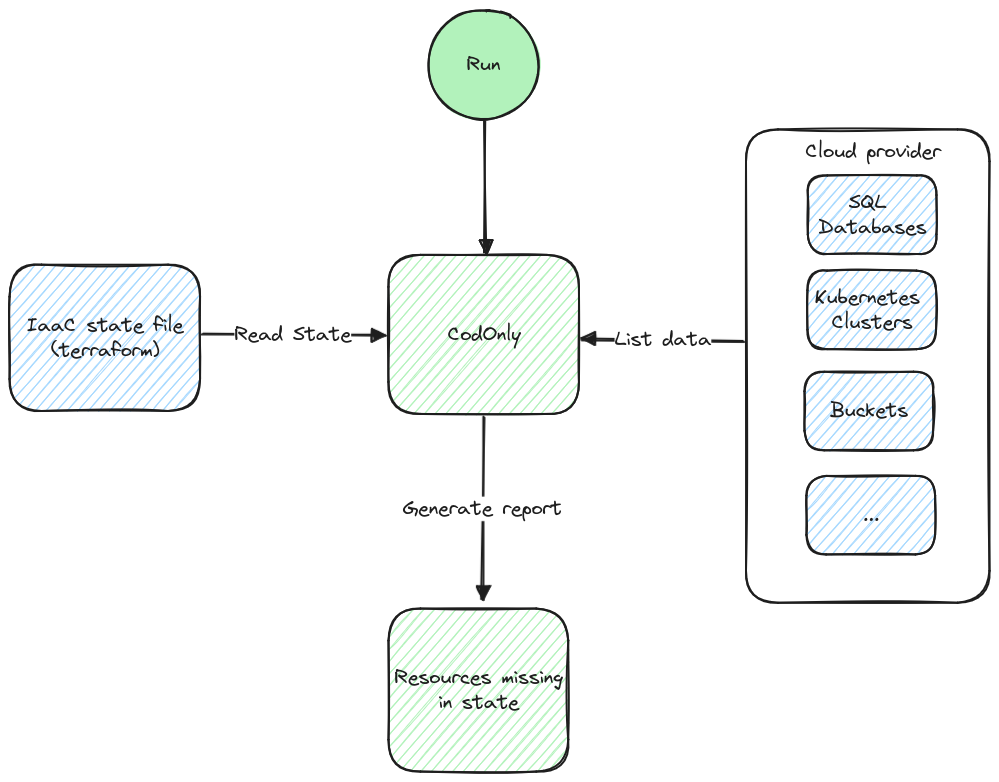

# Cod(e)Only

:warning: WIP!!!

Codonly is a simple project that helps to follow Infrastructure as a code (IaaC) prinple and also detect hanging resources in cloud or other third party envronments.

## Why?

I like to click around in cloud UIs and then when bills arive i'm usually pretty sad after realisation that I forgot to clean up resources I created.

Simply said, codonly helps to find resources that are not part of infrastructure management tooling.

## How?

Codonly uses IaaC tool (currently terraform) binary or directly state text file to read resources present in the state. After the state is loaded, codonly
uses APIs of a selected provider to read all possible resources and simply checks if they are in the state.

